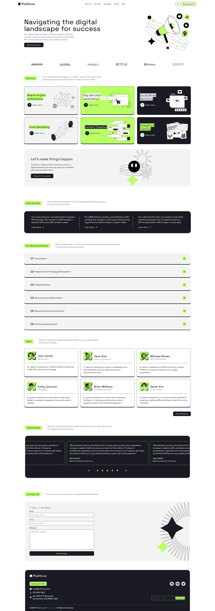

# Positivus - Beautiful Shadcn UI Landing Page

A modern, responsive landing page template built with Nuxt.js, Vue.js, Tailwind CSS, and Shadcn Vue UI.

## Demo

[Live Demo](https://positivus-prpanto.vercel.app)

## Preview



## Features

- Modern and clean design
- Fully responsive layout
- Built with Nuxt.js and Vue.js
- Styled with Tailwind CSS v4
- Built with [Shadcn Vue UI](https://www.shadcn-vue.com)
- Dark mode support
- [Figma template](https://www.figma.com/community/file/1230604708032389430)

## Getting Started

1. Clone the repository:

```bash
git clone https://github.com/prpanto/positivus.git
cd positivus
```

3. Install dependencies:

```bash
bun i
```

4. Start the development server:

```bash
bun dev
```

5. Open [http://localhost:3000](http://localhost:3000) in your browser to see the result.

## Contributing

If you have any suggestions or improvements, please create an issue or submit a pull request.

## License
MIT